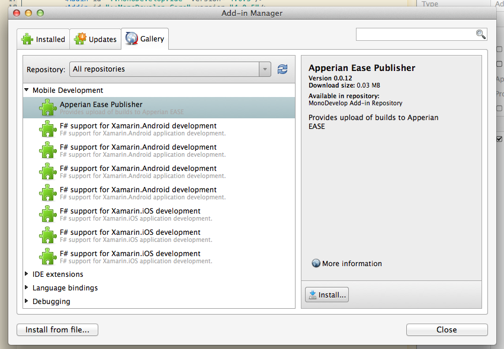
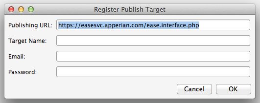

# Xamarin Studio Addin for EASE #

This guide describes how to use the Apperian Publisher addin to publish mobile apps to Apperian EASE directly from Xamarin Studio.

This addin is supported by Xamarin Studio version 4.0.5 or higher.

## About the Apperian publisher addin ##
Xamarin Studio is an IDE that allows you create mobile applications in C# for iOS (with Xamarin.iOS) or Android (with Xamarin.Android). The Apperian Publisher addin allows you to publish your mobile applications to Apperian EASE directly from Xamarin Studio.

Once the app is uploaded, an EASE Administrator can manage it through the EASE Portal.

## Install the Apperian Publisher addin ##
To use the Apperian Publisher addin, you first have to install it into Xamarin Studio.

First, open the addin manager

In the *Gallery* tab, choose *Apperian EASE Publisher* from the *Mobile Development* section, and *Install* it.

That's it.

**Note for Xamarin Studio Alpha (4.1.x) users**: the addin won't be listed in the gallery. You can get the addin file (.mpack) [directly from this page](http://addins.monodevelop.com/Project/Index/78) and install it with *Install from file...*

## Publish a Build ##
Now that the addin is installed, you can use it to publish your mobile application.

1. ### Select a mobile project.###
    The current selected project in Xamarin Studio is the one that will be uploaded. So make sure you're on a mobile (Xamarin.iOS or Xamarin.Android) project before you start.

    For iOS project, make sure as well the build platform is set to build for devices, not simulator. For this, either select *AppStore** or **Ad-Hoc** as configuration, or choose a real device as platform.

    

    Before you continue, make sure your project builds and has an icon file attached to it (or the upload will fail).

2. ### Choose Publish to Apperian ###
    From the *Project* menu, choose *Publish to Apperian...*
    
    

    At this point, the publish dialog will appear:

    

3. ### Pick or Register a publish target ###
    If you already have declared a target, you can pick it from the *Target:* combobox. At this point, the addin will contact the Apperian EASE API, authenticates you, and check if you're doing an update on an existing application, or publishing a new one.

    If you don't have any, you can click on *Register Publish Target...*

    * #### Register Publish Target ####

        
	
        Pick whatever you want for *Target Name*, it's a memo if you're publishing your application to multiple EASE backends/accounts. *Email* and *Password* are your EASE credentials. 
	
        *Note: Credentials are stored in your solution* .userprefs *file. Avoid putting that file in source control.*

    Once you've selected the publish target, the addin will connect to the EASE backend and get the descriptions and release notes of the previous upload, if any. *Description*, *Long description* and *Release Notes* are all mandatory fields, so fill them.

    *Note: Name, Author and Version fields are gathered from your mobile project configuration. Change them from there.*

4. ### Publish ###
    When you're done, hit *Publish*. If everything goes well, your application is now visible in the EASE web Portal.

